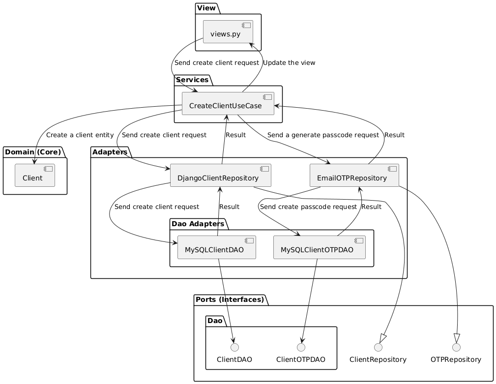
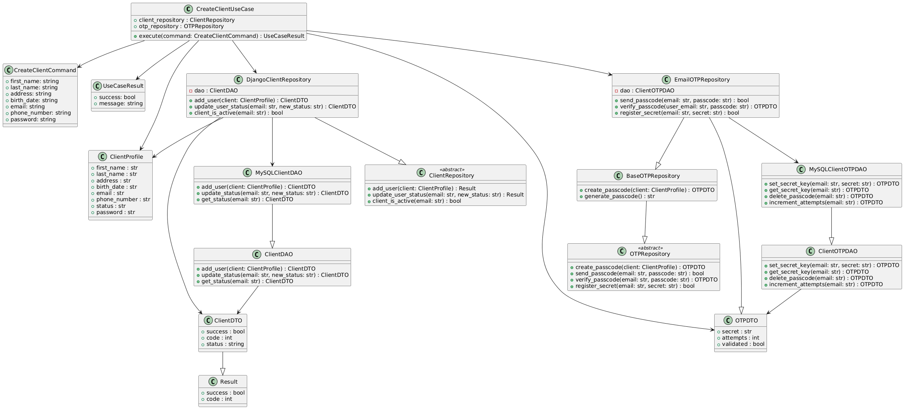
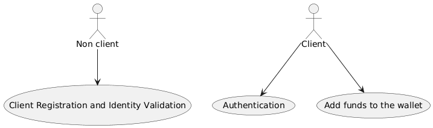

# BrokerX -  Architecture Documentation
This document is based on the arc42 model and describes the BrokerX platform, an web-based simulated stock broking platform made for LOG430, Fall 2025, ÉTS, Montréal.

## 1. Introduction and Goals
### Requirements overview
The BrokerX application is a web-based  client-server system for simulated stock broking. It is an educational project that aims to replicate in a simulated environment online broking applications such as Wealthsimple. No real money or personal information will be collected, exchanged, and/or used in the making, deployment and/or use of this application.

### Quality goals
Note that quality requirements refer strictly to Phase 1 of the project and will be updated in later phases to reflect the current expectations.

| Priority | Quality goal | Scenario |
|----------|------------------|----------|
| 1 | **Maintainability** | Separation of concerns through the use of the hexagonal architecture |
| 2 | **Persistence** | Support of a backend database with PostgreSQL |
| 3 | **Availability** | Greater or equal to 90% uptime |
| 4 | **Testability** | Coverage greater or equal than 80% |

### Stakeholders
- Developer : Learning how to design and implement a system from beginning to end.
- Clients : Exchange financial assets through a web-based interface.
- Professor/Lab assistants : Assess learning progress and competency.

---

## 2. Architectural Constraints
| Constraint | Description | Justification |
|----------|---------------|---------------|
| **Technologies** | Use of Python, Django, MySQL, Docker| Well documented and versatile tools |
| **Testing** | Pytest (unit testing), Cypress (E2E) | Reliable testing frameworks that allow full coverage |
| **CI/CD** | Continuous integration and deployment through GitHub Actions | Ease of use, tests and deployment automation |
| **Deployment** | Deployment in Docker containers | Chosen for simplicity and portability |
| **Educational** | Use of a monolithic architecture (Phase 1) | Must conform to course requirements |

## 3. System Scope and Context

### 3.1 Business Context

The system currently allows clients to add funds to their wallets. Additional functionalities (including placing order and seeing their portfolio) will be added during the following phases of the project.
### 3.2 Technical Context
- **Interface** - Web-based Django application
- **Persistence Layer**: MySQL database with DAO pattern.
- **Simulated Payment Service**: Python class that mocks a banking account for clients to withdraw money.

---

## 4. Solution Strategy
| Problem | Solution |
|---------|----------|
| **Separation of interfaces** | Hexagonal architecture with ports and adapter classes to isolate core business logic from external entities |
| **Persistence of data** | Use of the DAO pattern with Django ORM and the Data Transfer Object (DTO) pattern to communicate between the persistence layer and the service layer |
| **Testability** | Use of interfaces to simplify mocking of external sources and generation of coverage reports integrated into the CI pipeline |
| **Maintainability** | Layered architecture with DTOs to pass data between layers |

---

## 5. Building Block View
### Component Diagram (UC01)

Note that this represents only the logic for UC01 (Create user) for simplicity. In this architecture, the view represent an inbound adapter that directly receives requests from the user interface.

Services implement uses cases and serve to coordinate the different systems, as well as to update the view once an operation is completed.

Ports represent a contract with an external entity, whether it be part of the app, such as the DAO classes, or an external API, for example. It defines what methods and returns are expected from external entities.

Adapters implement ports and communicate with external entities through DTOs. Adapters of DAO ports are responsible for communicating with the database, while generic adapters such as `DjangoClientRepository` coordinates between multiple entities, though in this case each adapters is linked to only one other. In general, `DjangoClientRepository` can be thought of as an intermediary between the service layer and sources of clients, in this case the MySQL database.

### Class Diagram (UC01)

---

## 6. Runtime View

## 7. Deployment View

---

## 8. Cross-cutting Concepts
- DTO (Data Transfer Object) and DAO (Data Access Object) patterns
- Error and exception handling
- Logging and monitoring
- [ ] Configuration
- [ ] API versioning
- [ ] Performance optimizations
- [ ] Internationalization/localization (if applicable)

---

## 9. Design Decisions
### ADR 001 – Separation of concerns with the hexagonal architecture

### Status
Accepted

### Context

The application must be easy to maintain and extend. In particular, it must be able to evolve from a monolithic architecture into microservice-based and event-based. Moreover, testing must be facilitated and it must be easily connected to outside interfaces such as a database, external APIs, etc., without having to modify the core business logic. The different layers must be clearly separated and coupling must be reduced as much as possible. Both the hexagonal and MVC (Model-View-Controller) were considered for this purpose.

### Decision

The hexagonal architecture has been chosen as the basis for the architecture of the application.

It consists of the following elements:
- Ports : Interfaces to connect the application with external sources, such as the interface layer, a database or an API.
- Adapters : Concrete implementation of a port that allows communication between the business logic and external sources without coupling the two together.

### Consequences

The architectural choice will facilitate maintainability of the application as well as the transition to a microservice-based and event-driven platform. Moreover, it will reduce coupling between the different layers and simplify the addition of new functionalities and tests without having to modify the existing code.
The MVC architecture has been rejected because, even though it would simplify the initial phase implementation of the platform, its tighter coupling between the user interface and the application layer would reduce maintainability and complexify future developments.

## ADR 002 – Persistence of data with the DAO pattern

### Status
Accepted

### Context

The application must reliably and securely store information regarding its clients, including the details of every transaction for personal and legal purposes. Coupling between the business layer and the persistence layer must be minimal and the system must be open to having multiple data sources, for instance databases and CSV files.

### Decision

To access the MySQL database, the DAO (Data Access Object) will be used as a way to lessen coupling between the business layer and the persistence layer. Moreover, an ORM will be used within the DAO in order to streamline and simplify database queries. Both the DAO pattern and the ORM were in contention for the above purposes, however ultimately it has been decided that since they offer complementary roles, a combination of both yields the best results in the context of this application.

### Consequences
This choice for the persistence layer will isolate the data from the business layer and provide an abstraction to communicate with the database, namely a data access object interface. This decision will minimize coupling between both layers and provide a simple interface to make queries to the database. As such, it will promote high cohesion, facilitate unit testing by allowing for database mocking, and protect the business layer from modification and/or extension of the database model.

## ADR 003 – Implementation in Python with the Django Framework

### Status
Accepted

### Context

The application needs a platform to be developped on. After initial brainstorming, two otpions were left, Django or Java with SpringBoot. Considerations were made for performance, level of previous knowledge, ease of use, and more. This is a major decision that will impact the application for the rest of its life cycle, and is something that impacts how the application is conceived, tested, maintained and deployed.

### Decision

The Django framework has been chosen has the basis of this project.

Django is a popular and very well-documented framework, which played a part in this decision. Moreover, it offers various services such as an authentication system, an ORM, a logging system, and more. The convenience of having such features bundled in a single framework made this an attractive option. Furthermore, Django allows easy and traceable database migrations, which factored in the benefits of using it. Additionally, the fact that I am familiar with Django and have no experience with SpringBoot had a role in this decision.

### Consequences

The choice of framework will impact how the application is designed. The main drawback of Django is its inferior performances when compared to Java, however I believe that with smart caching and other techniques, the quality requirements for the project will be able to be met and even exceeded with Django.

---

## 10. Quality Requirements

### Performance
- Fast response time for MySQL queries
- Support many users at once

### Testability
- Coverage for unit tests greater or equal to 80%
- Full unit, integration and E2E testing
- Automated coverage report in CI

### Reliability
- No failure in case of a system error
- Logging of errors

---

## 11. Risks and Technical Debt
- [ ] Known technical risks
- [ ] Potential architectural trade-offs
- [ ] Mitigation strategies
- [ ] Assumptions and limitations

---

## 12. Glossary
- [ ] List of domain-specific terms
- [ ] Acronyms and abbreviations
- [ ] Links to external references

---

# 📎 Appendices

## Runbook

### Overview
This runbook provides operational procedures and troubleshooting steps for managing BrokerX.

### Starting with Docker
#### Starting with `deploy.sh` script
1. To start the service, begin by cloning the Github repository.
2. Run `BrokerX/brokerX/deploy.sh`
3. The application should now be running on port 8000

#### Starting manually
If you prefer not to use the script or it does not work, you can follow these steps.
1. To start the service, begin by cloning the Github repository.
2. Go to `BrokerX/brokerX`
3. Run `docker compose down -v` (or `docker compose down` if you want previous data to persist)
4. Run `docker compose build`
5. Run `docker compose up` (or `docker compose up -d` if you want it running in the background)
6. The application should now be running on port 8000

#### Using the VM
Note that the `deploy.sh` script is automatically called on the VM in the CD script. You can access
the application at `http://10.194.32.208:8000/`.

### Diagnosticating errors
Errors are automatically logged in the `django.error_logs` file, alternatively you can use the command
`docker logs -f broker_app` or `docker logs -f broker_mysql` to access the docker logs.

### Accessing the database
You can access the MySQL command line as root by running the following command:
`docker exec -it broker_mysql mysql -u root -p`

### Running tests
You can run the tests by running the command
`docker exec broker_app python -m pytest`, or if you wish to get the coverage
`docker exec broker_app python -m pytest --cov=broker --cov-config=.coveragerc --cov-report=term-missing`

## B. References
- This project has been made in collaboration with chatGPT for the purposes listed below. Note that uses of artifical intelligence in this project is limited to strictly those listed below. In particular, it has **not** be used to generate artefacts.
  - Creation of templates for use cases, glossary, MoSCoW priorization table and arc42.
  - Asking if the artefacts satisfy the requirements.
  - Used as a search engine.
  - Improve readibility (phrasing, grammar, spelling, etc)
- Petrillo, F. (2025, Fall). Class notes [pdf]. LOG430, École de Technologie Supérieure.
- Ullman, G. (2025, Fall). Github labs. LOG430, École de Technologie Supérieure.

