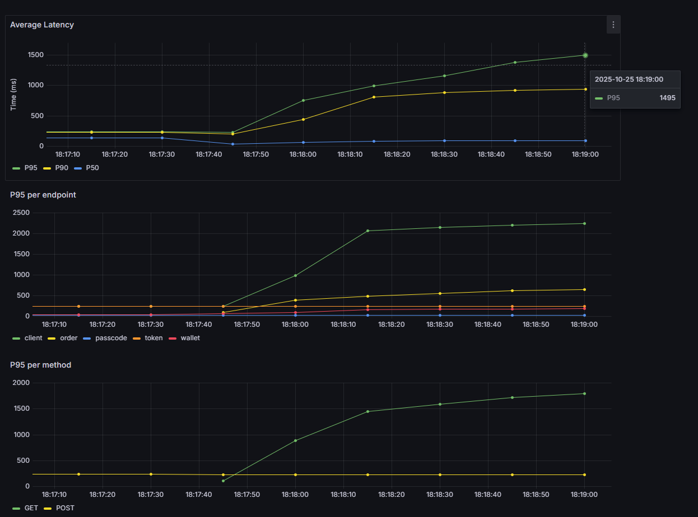
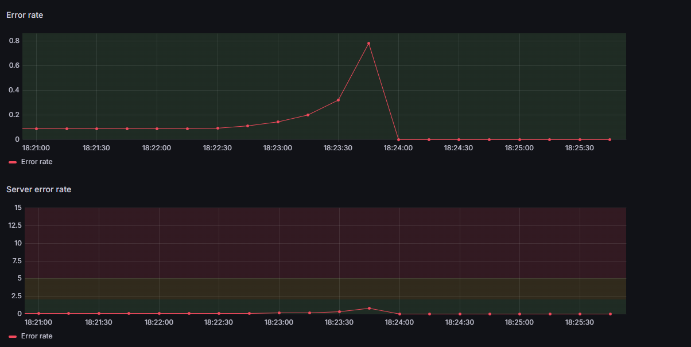

## Table of Contents
- ARC42
  - [1. Introduction and Goals](#1-introduction-and-goals)
  - [2. Architectural Constraints](#2-architectural-constraints)
  - [3. System Scope and Context](#3-system-scope-and-context)
  - [4. Solution Strategy](#4-solution-strategy)
  - [5. Building Block View](#5-building-block-view)
  - [6. Runtime View](#6-runtime-view)
  - [7. Deployment View](#7-deployment-view)
  - [8. Cross-cutting Concepts](#8-cross-cutting-concepts)
  - [9. Design Decisions](#9-design-decisions)
  - [10. Quality Requirements](#10-quality-requirements)
  - [11. Risks and Technical Debt](#11-risks-and-technical-debt)
  - [12. Glossary](#12-glossary)
- [Performance reports](#performance-reports)
- [Runbook](#runbook)
- [Demo Guide](#demo-guide)
- [MoSCoW Prioritization Table](#moscow-prioritization-table)
- [Phase 2 retrospective](#phase-2-retrospective)
- [References](#references)

This document is based on the arc42 model available at https://arc42.org/overview.

## 1. Introduction and Goals
### Requirements overview
BrokerX is a web-based application for simulated stock broking. It is an educational project that aims to replicate in a simulated environment online broking applications such as WealthSimple. No real money or personal information will be collected, exchanged, and/or used in the making, deployment and/or use of this application.

### Phase 2 overview
The central goal of phase 2 was to improve performance and set up monitoring to build a robust environment. Several changes were introduced, including, but not limited to:
- The user interface was decoupled from the backend which now serves JSON responses through a REST API.
- A Next.js frontend with React was made to communicate with BrokerX. Since it is considered external to BrokerX, it will not be discussed as part of the application.
- The application was migrated from a monolithic architecture to microservices.

### Quality goals

| Priority | Quality goal | Scenario |
|----------|------------------|----------|
| 1 | **Maintainability** | Separation of concerns through the use of the hexagonal architecture within each service |
| 2 | **Persistence** | Support of a backend database per service with MySQL|
| 3 | **Availability** | Greater or equal to 95.5% uptime |
| 4 | **Testability** | Coverage greater or equal than 80% |
| 5 | **Traceability** | Logging of errors in dedicated files |
| 6* | **Deployability** | Services must be deployable independently |
| 7* | **Scalability** | Must allow for a high number of concurent users
| 8* | **Reliability** | Must remain operable if one or several services fail |
| 9* | **Performance** | See section [Performance Reports](#performance-reports)

\* These quality goals were added in phase 2.

### Stakeholders
- Developer : Learning how to design and implement a system from beginning to end.
- Clients : Exchange financial assets through a web-based interface.
- Professor/Lab assistants : Assess learning progress and competency.

## 2. Architectural Constraints
| Constraint | Description | Justification |
|----------|---------------|---------------|
| **Backend Technologies** | Use of Python, Django, MySQL, Docker | Well documented and versatile tools |
| **REST API** | KrakenD, JWT, Postman, Swagger | Follows RESTful practices, API gateway to handle inter-service communication with authentication |
| **Testing** | Pytest (unit  and integration testing), K6 (stress tests) | Reliable testing frameworks that allow full coverage and simulation of real usage |
| **Monitoring** | Prometheus, Grafana | Open-source tools with Django integration for easy monitoring and dashboards |
| **Logging** | Loki for easy and reliable logging |
| **Caching** | Redis | Fast server side caching on certain endpoint
| **CI/CD** | Continuous integration and deployment through GitHub Actions | Ease of use, tests and deployment automation |
| **Deployment** | Deployment in Docker containers | Chosen for simplicity and portability |

## 3. System Scope and Context

### 3.1 Business Context

The system currently allows clients to add funds to their wallets. Additional functionalities (including placing order and viewing their portfolio) will be added during the following phases of the project.
### 3.2 Technical Context
- **Interface** - Next.js web app with React
- **Client service** - Client registration and authentication
- **Wallet service** - Wallet funding
- **Order service** - Order placement
- **Stock service** - Portfolio management
- **Persistence Layer**: MySQL databases with DAO pattern.
- **Simulated Payment Service**: Python module that mocks a banking account for clients to simulate withdrawing money from an external bank.

## 4. Solution Strategy
| Problem | Solution |
|---------|----------|
| **Separation of concerns** | Microservices to isolate domain related operations and allow for partial deployability |
| **Persistence of data** | Use of the DAO pattern with Django ORM and the Data Transfer Object (DTO) pattern to communicate between the persistence layer and the service layer |
| **Testability** | Use of interfaces to simplify mocking of external sources and generation of coverage reports integrated into the CI pipeline |
| **Maintainability** | Layered architecture within each service with DTOs to pass data between layers |
|**Integrity**| Idempotency key on sensitive operations |
|**Communication between service**| API Gateway to route traffic to the appropriate service

## 5. Building Block View
### Component Diagram (UC01)

Note that this represents only one service (client) for simplicity, but unless otherwise mentioned every service follows this structure inherited from the monolithic architecture. In fact, every service is a monolith with a hexagonal architecture. In this architecture, the view represents an inbound adapter that directly receives requests from the user interface.

Services implement uses cases and serve to coordinate the different systems, as well as to update the view once an operation is completed.

Ports represent a contract with an external entity, whether it be part of the app, such as the DAO classes, or an external API, for example. It defines what methods and returns are expected from external entities.

Adapters implement ports and communicate with external entities through DTOs. Adapters of DAO ports are responsible for communicating with the database, while generic adapters such as `DjangoClientRepository` coordinates between multiple entities, though in this case each adapter is linked to only one other. In general, `DjangoClientRepository` can be thought of as an intermediary between the service layer and sources of clients, in this case the MySQL database.

### Class Diagram (Client)

Other services follow the same pattern.

## 6. Runtime View
The following diagram shows the uses cases and the actors who can trigger them.

## 7. Deployment View

Note that in the context of the course, every service are deployed on the same host, however it is possible to deploy them on separate hosts which would allow to use more ressources and thus improve performance.

## 8. Cross-cutting Concepts
- DTO (Data Transfer Object) and DAO (Data Access Object) patterns
- Error and exception handling
- Logging and monitoring
- Transactions
- Clients

## 9. Design Decisions
### ADR 001 – Separation of concerns with the hexagonal architecture (Phase 1)

### Status
Accepted

### Context

The application must be easy to maintain and extend. In particular, it must be able to evolve from a monolithic architecture into microservice-based and event-based. Moreover, testing must be facilitated and it must be easily connected to outside interfaces such as a database, external APIs, etc., without having to modify the core business logic. The different layers must be clearly separated and coupling must be reduced as much as possible. Both the hexagonal and MVC (Model-View-Controller) were considered for this purpose.

### Decision

The hexagonal architecture has been chosen as the basis for the architecture of the application.

It consists of the following elements:
- Ports : Interfaces to connect the application with external sources, such as the interface layer, a database or an API.
- Adapters : Concrete implementation of a port that allows communication between the business logic and external sources without coupling the two together.

### Consequences

The architectural choice will facilitate maintainability of the application as well as the transition to a microservice-based and event-driven platform. Moreover, it will reduce coupling between the different layers and simplify the addition of new functionalities and tests without having to modify the existing code.
The MVC architecture has been rejected because, even though it would simplify the initial phase implementation of the platform, its tighter coupling between the user interface and the application layer would reduce maintainability and complexify future developments.

## ADR 002 – Persistence of data with the DAO pattern (Phase 1)

### Status
Accepted

### Context

The application must reliably and securely store information regarding its clients, including the details of every transaction for personal and legal purposes. Coupling between the business layer and the persistence layer must be minimal and the system must be open to having multiple data sources, for instance databases and CSV files.

### Decision

To access the MySQL database, the DAO (Data Access Object) will be used as a way to lessen coupling between the business layer and the persistence layer. Moreover, an ORM will be used within the DAO in order to streamline and simplify database queries. Both the DAO pattern and the ORM were in contention for the above purposes, however ultimately it has been decided that since they offer complementary roles, a combination of both yields the best results in the context of this application.

### Consequences
This choice for the persistence layer will isolate the data from the business layer and provide an abstraction to communicate with the database, namely a data access object interface. This decision will minimize coupling between both layers and provide a simple interface to make queries to the database. As such, it will promote high cohesion, facilitate unit testing by allowing for database mocking, and protect the business layer from modification and/or extension of the database model.

## ADR 003 – Implementation in Python with the Django Framework (Phase 1)

### Status
Accepted

### Context

The application needs a platform to be developed on. After initial brainstorming, two options were left, Django or Java with SpringBoot. Considerations were made for performance, level of previous knowledge, ease of use, and more. This is a major decision that will impact the application for the rest of its life cycle, and is something that impacts how the application is conceived, tested, maintained and deployed.

### Decision

The Django framework has been chosen as the basis of this project.

Django is a popular and very well-documented framework, which played a part in this decision. Moreover, it offers various services such as an authentication system, an ORM, a logging system, and more. The convenience of having such features bundled in a single framework made this an attractive option. Furthermore, Django allows easy and traceable database migrations, which factored in the benefits of using it. Additionally, the fact that I am familiar with Django and have no experience with SpringBoot had a role in this decision.

### Consequences

The choice of framework will impact how the application is designed. The main drawback of Django is its inferior performances when compared to Java, however I believe that with smart caching and other techniques, the quality requirements for the project will be able to be met and even exceeded with Django.

## ADR 004 – Caching with Redis

### Status
Accepted

### Context

Caching is an essential strategy to improve latency on common endpoints. It allows to bypass database queries on GET endpoints which are costly operations, as well as quickly failing if two many connections are set at once. Therefore, caching lightens the load on the database which makes the whole application faster and more reliable

### Decision

Redis as been chosen as the backend cache.

Redis is a popular and fast key-value database used as a caching mecanism for backends. It has been chosen for this project for its usability with simple and easily readable syntax, its readily available documentation and fast performance. A redis instance will be deployed for every service that needs caching and will use a write-through invalidation method, in other words, when a value is written to the database, it will also be written to Redis, ensuring a high level of cohesion between the two.

### Consequences

Redis will improve the performance of the application and be used everywhere a query is made to the database. To ensure data integrity between Redis and the database, it is essential to update both at the same time.

## ADR 005 – KrakenD API Gateway for communication between services

### Status
Accepted

### Context

Services must be able to communicate with each other, however we want to avoid front end users interacting directly with the services, there we must put an API layer in front. This will allow to have control over the requests that are sent to the services.

### Decision

KrakenD as been chosen as the API gateway.

KrakenD will provide the API Gateway to arrange traffic between services. It has been chosen its simple configuration and customization which allows for authorization with JWT tokens, caching and load balancing.

### Consequences

Requests will now all have to be routed to the API gateway rather than directly to the backend. This means that the gateway must correctly direct HTTP requests to the appropriate service and transmit responses.

## 10. Quality Requirements

### Performance
- Throughout of ≥ 800 ordres/s  on orders
- P95 latency ≤ 250 ms

### Testability
- Coverage for unit tests greater or equal to 80%
- Full unit, integration and E2E testing
- Automated coverage report in CI

### Reliability
- No failure in case of a system error
- Logging of errors

### Deployability
- Possibility of deploying only some of the services

## 11. Risks and Technical Debt
- The migration to microservices comes with a higher level of complexity
- Using Django might lead to performance issues.
- MySQL with the Django ORM might struggle under a high load.

### Mitigation Strategies
- High coverage testing to detect bug as they are created.
- Caching and load balancing to improve performance

## 12. Glossary
| Term                   | Definition                                                                                           |
|------------------------|----------------------------------------------------------------------------------------------------|
| Hexagonal Architecture | An architecture model that isolates the core business logic from external entities |
| Client                 | An individual that uses the platform and any number of its functionalities.             |
| User   |  Used strictly for Django authentication. Not to confuse with Client, which is a part of the DDD. The user is simply the default Django model to authenticate clients |
| (Digital) Wallet       | Capital that a client has available in their account to make transactions.                          |
| Deposit                | Adding funds to a client's wallet.                                                                  |
| Auditing               | Examination of financial assets and operations of an entity for legal and management purposes.     |
| Simulated Payment System | Represents an external source from which clients can withdraw money (e.g., a bank).               |
| Transaction            | Operation in which financial assets or funds are exchanged.                                        |
| DAO (Data Access Object) | Pattern that aims to isolate database queries |
| DTO (Data Transfer Object) | Pattern that allows passing data between layers |
| Microservices | An architectural paradigm in which domain related operations are separated into distinct, independent units|
| API Gateway | Allows for communication with microservices |
| Monitoring | Data collection for performance analysis of a software program |

## Performance reports
The following table presents key metrics that were polled at different stages of the application's lifecycle. Metrics were taken with 150 concurrent user.

### Methodology
The stress tests use `k6` to simulate HTTP traffic to `broker-app:8000`. The set up phase creates 150 users and keeps their tokens in an array. Then, virtual users randomly select a token and call the specified endpoints with this token. This ensures that as virtual users loop through the calls, they do not create more than 150 clients. Client registration and passcode validation are rare events, thus including them at a similar rate to common operations skews results.
The tests ramp up to 150 users in 15 seconds, then remained steady for a 1 minute, then have a 30s rampdown.

Because of time constraints (see [Phase 2 Retrospective](#phase-2-retrospective)), performance for the microservices was not reported.

| Metric                                   | Monolith | Monolith + Redis |
|------------------------------------------|-----------|------------------|
| P95                                      | 1495ms    | 468ms            |
| P90                                      | 936ms     | 429ms            |
| P50                                      | 95.5ms    | 175ms            |
| Throughput (orders/s)                    | 81.3      | 120              |
| P95 on POST /order                       | 649ms     | 475ms            |
| Max concurrent users (error rate < 5%)   | 150       | 170              |

### Observations

#### Monolithic

#### Monolithic + Redis
The addition of Redis significantly improved performance on the app, decreasing the P95 by 319%. We can see through the Redis CLI that more than 90% of requests to Redis hits the cache, in other words 90% of requests that previously went to the database are now being handled by Redis, which explains the spike in performance. Redis however only serves fetch operations, the others thus need to be a focus for further optimization.

## Runbook

### Overview
This runbook provides operational procedures and troubleshooting steps for managing BrokerX.

#### Running with `deploy.sh` script
1. To start the service, begin by cloning the Github repository available at https://github.com/William-Lavoie/log430-a25-labo5 or use the ZIP file with the source code.
2. Run `BrokerX/deploy.sh` with the name of the services you want to run (i.e `BrokerX/deploy.sh client`) to launch only the client service. By default, the client and the wallet service are launched. Note that these are the only functional services as of now.
3. The frontend application should now be running on port 3000 (`http://localhost:3000/`)
4. You can access the Swagger documentation at `http://localhost:8001/api/`

#### Running manually
If you prefer not to use the script or it does not work, you can follow these steps.
1. Go to the directory of the service you wish to run (e.g `client_service`)
2. Run `docker compose down -v` (or `docker compose down` if you want previous data to persist)
3. Run `docker compose build`
4. Run `docker compose up` (or `docker compose up -d` if you want it running in the background)
5. Follow steps 3-5 in the `gateway` directory.
6. Go to `react_frontend`
7. Run `npm install`
8. Run `npm run dev`

### Diagnosing errors
Errors are automatically logged in the various log files under the `log` directory in each service. Every service has a separate log files for http requests, mysql, redis and general messages.

### Accessing the database for a service
You can access MySQL command line as root by running the following command in the service's directory:
`docker exec -it {service}-mysql mysql -u root -p`

### Running tests
You can run the tests by running the command  in the service's directory:
`docker exec {service-app} python -m pytest`

## Demo Guide

This demo guide concerns UC01, UC02 and UC03 and UCO5 (the latter 2 are unfortunately unavailable currently).

### **1. Create an account**
1. Navigate to `/login`. Note that you can reach this page by pressing *Logout* in the navbar.
2. Click on `I don't have an account`
3. Enter your information. Note that *Preferred communication method* is currently not operational and *email* will be chosen despite what you pick.
4. Click "Submit". If any of the information your entered is not correct, you will be notified.

### 2. Verify your passcode
1. A passcode has been sent to you by email, however since no SMTP server is configured at the moment, the passcode is sent through logs. Please look at `BrokerX\client_service\logs\client.logs` to know your passcode.
2. Navigate to `/create_account/validate_passcode`.
3. Enter your passcode.
4. Click submit (it is hard to see but the button is on the bottom right of the page).
5. Go back to `/login`
6. Enter your information and click on submit.

### 3. Add funds to your wallet (NOT FUNCTIONAL)
1. In the navbar, click on "Wallet".
2. Your current balance will be shown. It should be 0$.
3. Enter the amount you wish to add.
4. Click on "submit"
5. The amount is automatically increased. Note that there is a 10,000$ limit on wallets.
Please note that since the payment system is simulated, you can always withdraw at most 1000$ at a time, however specific value (10.0, 20.0, 30.0, 40.0, 50.0, 60.0, 70.0, 80.0) trigger errors as a way to tests potential errors coming from the external payment service.

### 4. Place order (NOT FUNCTIONAL)
1. In the navbar, client on *Place Order*
2. Enter the requested information
3. Click on "submit".

### Additional Notes
- Your session will remain active until you log out manually or the session expires.

## MoSCoW Prioritization Table

| Use Case ID | Use Case Title                              | Priority             | Justification                                                                 |
|-------------|----------------------------------------------|----------------------|-------------------------------------------------------------------------------|
| UC-01       | User Registration                            | 🔵 Done              | Necessary for clients to access the platform.                                |
| UC-02       | Authentication and MFA                       | 🔵 Done              | Clients need a secure and reliable way to log in while protecting their identity and personal information. |
| UC-03       | Adding Funds to Wallet (Virtual Deposit)     | 🔵 Done              | Clients need funds to place buy orders.                                      |
| UC-04       | Subscription to Market Data                  | 🟡 Could             | Allows clients to consult real-time quotations to make informed decisions without reliance on an external information source. |
| UC-05       | Placing Buy/Sell Orders                      | 🔴 Must            | Core feature that clients sign up for.                                       |
| UC-06       | Modification/Cancellation of Orders          | 🟡 Could             | Gives clients flexibility and peace of mind.                                 |
| UC-07       | Internal Matching and Execution              | 🔴 Must            | Transactions between buyers and sellers cannot be completed without this.    |
| UC-08       | Confirmation of Executions and Notifications | 🟢 Won't (In Phase 2) | Nice to have for transparency and client trust.                              |

## Phase 2 retrospective

The application is unfortunately only partially functional at this stage. Because of time constraints, I migrated too late to a microservices architecture and was not able to make it work in time. As such, only the client service can be used fully, and monitoring does not work. However, before the migration, the application was working in its entirety, and had monitoring with Prometheus and Grafana.

Authentication with JWT token, monitoring, stress tests, load balancing and use cases UC05 were implemented and functional in the previous monolithic application, but have not been ported to the new microservices architecture. The code for the monolith can still be found in the directory `brokerX`. Everything missing will be added during phase 3.

This phase is a failure, however the migration to microservices makes the code more modular and extensible, and several missing features have been implemented but were simply not ported to the microservices architecture for time constraints. For these reasons, I am hopeful that the project will be completed in time for phase 3.

&#9679; Implemented
- Test coverage is satisfactory
- Hexagonal architecture is followed for each service
- Error handling in the backend and logging
- REST API with Swagger documentation
- Reproductible migrations
- Functional and easy script to quickly deploy
- Domain well defined
- Pre-commit hook with linters (black, mypy and isort)

&#9679; Needs Improvement
- Improve UI styling and reactivity, especially on mobile
- Show error messages in the UI
- JWT authentication
- CI script generates coverage report, has healthchecks, and a badge on the README
- CD script deploys automatically on VM
- Incomplete microservices architecture

&#9679; Missing
- E2E testing
- Sending emails (no SMTP server)
- Allow SMS messages
- Rollback script
- Monitoring for microservices
- CI/CD is non functional
- Load balancing
- Postman collection

## References
- This project has been made in collaboration with chatGPT for the purposes listed below. Note that uses of artificial intelligence in this project is limited to strictly those listed below. In particular, it has **not** been used to generate artifacts.
  - Creation of templates for use cases, glossary, MoSCoW prioritization table and arc42.
  - Asking if the artifacts satisfy the requirements.
  - Used as a search engine.
  - Improve readability (phrasing, grammar, spelling, etc)
  - Debugging

- Petrillo, F. (2025, Fall). Class notes [pdf]. LOG430, École de Technologie Supérieure.
- Ullman, G. (2025, Fall). Github labs. LOG430, École de Technologie Supérieure.
- Documentation for all the dependencies listed in requirements.txt as well as any technology mentionned in this document

