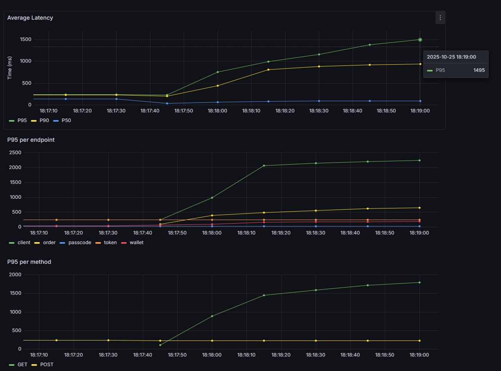
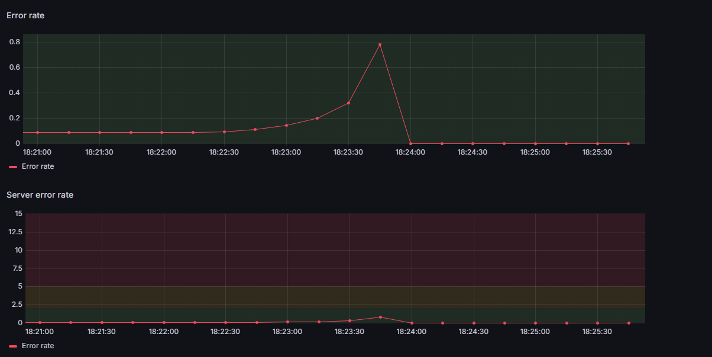

## Performance reports
The following table presents key metrics that were polled at different stages of the application's lifecycle. Metrics were taken with 150 concurrent user.

### Methodology
The stress tests use `k6` to simulate HTTP traffic to `broker-app:8000`. The set up phase creates 150 users and keeps their tokens in an array. Then, virtual users randomly select a token and call the specified endpoints with this token. This ensures that as virtual users loop through the calls, they do not create more than 150 clients. Client registration and passcode validation are rare events, thus including them at a similar rate to common operations skews results.
The tests ramp up to 150 users in 15 seconds, then remained steady for a 1 minute, then have a 30s rampdown.

| Metric                           | Monolith                | Monolith + Redis           | Monolith + Redis + Nginx    | Microservices              |
|----------------------------------|-------------------------|----------------------------|-----------------------------|----------------------------|
| P95                              | 1495ms                       | 468ms                         | -                           | -                          |
| P90                              | 936ms                       | 429ms | -                           | -                          |
| P50                              |  95.5ms       | 175ms | -                           | -                          |
| Throughput (orders/s)            |  81.3    | -| -                           | -                          |
| P95 on POST /order               | 488ms        | - | -                           | -                          |
| Max concurrent users (error rate < 5%) | 150                       | 170                          | -                           | -                          |

### Observations

#### Monolithic

#### Monolithic + Redis
The addition of Redis significantly improved performance on the app, decreasing the P95 by 319%. We can see through the Redis CLI that more than 90% of requests to Redis hits, in other words 90% of requests that previously went to the database are now being handled by Redis, which explains the spike in performance. Redis however only serves fetch operations, the others thus need to be a focus for further optimization.

